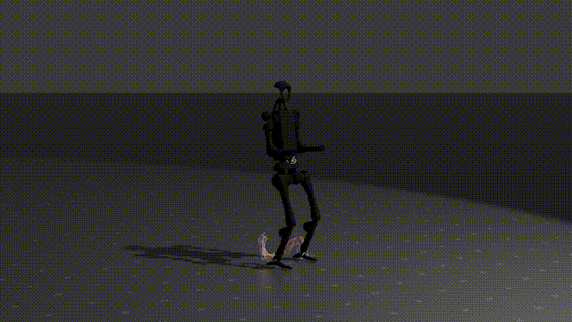

# DIAL-MPC Render Script

This is a collection of scripts to render the DIAL-MPC results in Blender.

| Go2 Rendering Result | H1 Rendering Result |
| :------------------: | :-----------------: |
|  |  |

## Tempelate Files

We provide the template files for the motion data of Go2 and H1 in Google Drive.

- [Go2 Template](https://drive.google.com/file/d/1P5khZuAXrZJd7vPlD8zfjrtDuKgXGEQD/view?usp=sharing)
- [H1 Template](https://drive.google.com/file/d/1ZICQdzsb8vNpvwAhrjVBHu3adQ_HAB2z/view?usp=sharing)

## Usage

First, record the motion data in mujoco, save `qpos` to `.npy` file.

Next, run the converting script to get the blender-compatible `.npy` file.

```bash
# For Go2
python convert_state_go2.py
# For H1
python convert_state_h1.py
```

Finally, open Blender, open the `script` tab, run the `import_blender_go2.py` or `import_blender_h1.py` to visualize the motion.

> [!NOTE]
> Please modify the import path in the script to the path of your blender python site-package path. 

## Credit

[Huy Ha Mujoco-blender Render](https://github.com/real-stanford/scalingup/blob/master/docs/visualization.md)