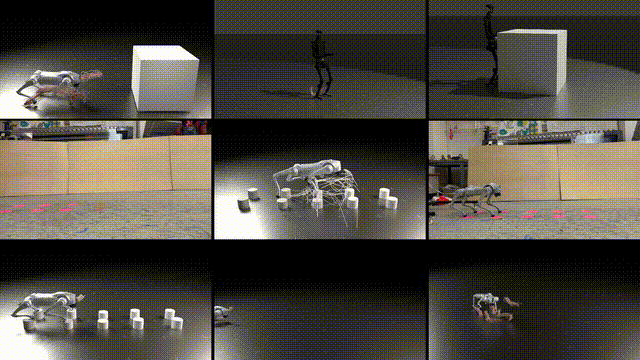
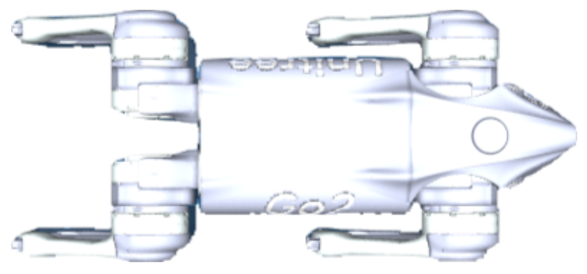

# DIAL-MPC: Diffusion-Inspired Annealing For Legged MPC

<div align="center">

[[Website]](https://lecar-lab.github.io/dial-mpc/)
[[PDF]](https://drive.google.com/file/d/1Z39MCvnl-Tdraon4xAj37iQYLsUh5UOV/view?usp=sharing)
[[Arxiv]](https://arxiv.org/abs/2409.15610)

[](https://github.com/google/jax)
[](https://opensource.org/licenses/Apache-2.0)



</div>

This repository contains the code (simulation and real-world experiments with minimum setup) for the paper "Full-Order Sampling-Based MPC for Torque-Level Locomotion Control via Diffusion-Style Annealing".

DIAL-MPC is a sampling-based MPC framework for legged robot ***full-order torque-level*** control with both precision and agility in a ***training-free*** manner. 
DIAL-MPC is designed to be simple and flexible, with minimal requirements for specific reward design and dynamics model. It directly samples and rolls out in physics-based simulations (``Brax``) and does not require reduced-order modeling, linearization, convexification, or predefined contact sequences.
That means you can test out the controller in a plug-and-play manner with minimum setup.

## News

- 11/03/2024: 🎉 Sim2Real pipeline is ready! Check out the [Sim2Real](#deploy-in-real-unitree-go2) section for more details.
- 09/25/2024: 🎉 DIAL-MPC is released with open-source codes! Sim2Real pipeline coming soon!

https://github.com/user-attachments/assets/f2e5f26d-69ac-4478-872e-26943821a218


## Table of Contents

1. [Install](#install-dial-mpc)
2. [Synchronous Simulation](#synchronous-simulation)
3. [Asynchronous Simulation](#asynchronous-simulation)
4. [Deploy in Real](#deploy-in-real-unitree-go2)
5. [Writing Your Own Environment](#writing-custom-environment)
6. [Rendering Rollouts](#rendering-rollouts-in-blender)
7. [Citing this Work](#bibtex)

## Simulation Setup

### Install `dial-mpc`

> [!IMPORTANT]
> We recommend Ubuntu >= 20.04 + Python >= 3.10 + CUDA >= 12.3.
> You can create a mamba (or conda) environment before proceeding.

Our environment is Ubuntu 22.04 + Python 3.10 + CUDA 12.6.

```bash
git clone https://github.com/LeCar-Lab/dial-mpc.git --depth 1
cd dial-mpc
pip3 install -e .
```

## Synchronous Simulation

In this mode, the simulation will wait for DIAL-MPC to finish computing before stepping. It is ideal for debugging and doing tasks that are currently not real-time.

#### Run Examples

List available examples:

```bash
dial-mpc --list-examples
```

Run an example:

```bash
dial-mpc --example unitree_h1_jog
```

After rollout completes, go to `127.0.0.1:5000` to visualize the rollouts.

## Asynchronous Simulation

The asynchronous simulation is meant to test the algorithm before Sim2Real. The simulation rolls out in real-time (or scaled by `real_time_factor`). DIAL-MPC will encounter delay in this case.

When DIAL-MPC cannot finish the compute in the time defined by `dt`, it will spit out warning. Slight overtime is accepetable as DIAL-MPC maintains a buffer of the previous step's solution and will play out the planned action sequence until the buffer runs out.

List available examples:

```bash
dial-mpc-sim --list-examples
```

Run an example:

In terminal 1, run

```bash
dial-mpc-sim --example unitree_go2_seq_jump_deploy
```
This will open a mujoco visualization window.

In terminal 2, run

```bash
dial-mpc-plan --example unitree_go2_seq_jump_deploy
```


## Deploy in Real (Unitree Go2)

### Overview

The real-world deployment procedure is very similar to asynchronous simulation.

We use `unitree_sdk2_python` to communicate with the robot directly via CycloneDDS.

### Step 1: State Estimation

For state estimation, this proof-of-concept work requires external localization module to get base **position** and **velocity**.

The following plugins are built-in:

- ROS2 odometry message
- Vicon motion capture system

#### Option 1: ROS2 odometry message

Configure `odom_topic` in the YAML file. You are responsible for publishing this message at at least 50 Hz and ideally over 100 Hz. We provide an odometry publisher for Vicon motion capture system in [`vicon_interface`](https://github.com/LeCAR-Lab/vicon_interface).

> [!CAUTION]
> All velocities in ROS2 odometry message **must** be in **body frame** of the base to conform to [ROS odometry message definition](https://docs.ros.org/en/noetic/api/nav_msgs/html/msg/Odometry.html), although in the end they are converted to world frame in DIAL-MPC.

#### Option 2: Vicon (no ROS2 required)

1. `pip install pyvicon-datastream`
2. Change `localization_plugin` to `vicon_shm_plugin` in the YAML file.
3. Configure `vicon_tracker_ip`, `vicon_object_name`, and `vicon_z_offset` in the YAML file.

#### Option 3: Bring Your Own Plugin

We provide a simple ABI for custom localization modules, and you need to implement this in a python file in your workspace, should you consider not using the built-in plugins.

```python
import numpy as np
import time
from dial_mpc.deploy.localization import register_plugin
from dial_mpc.deploy.localization.base_plugin import BaseLocalizationPlugin

class MyPlugin(BaseLocalizationPlugin):
    def __init__(self, config):
        pass

    def get_state(self):
        qpos = np.zeros(7)
        qvel = np.zeros(6)
        return np.concatenate([qpos, qvel])

    def get_last_update_time(self):
        return time.time()

register_plugin('custom_plugin', plugin_cls=MyPlugin)
```

> [!CAUTION]
> When writing custom localization plugin, velocities should be reported in **world frame**.

> [!NOTE]
> Angular velocity source is onboard IMU. You could leave `qvel[3:6]` in the returned state as zero for now.

Localization plugin can be changed in the configuration file. A `--plugin` argument can be supplied to `dial-mpc-real` to import a custom localization plugin in the current workspace.

### Step 2: Installing `unitree_sdk2_python`

> [!NOTE]
> If you are already using ROS2 with Cyclone DDS according to [ROS2 documentation on Cyclone DDS](https://docs.ros.org/en/humble/Installation/DDS-Implementations/Working-with-Eclipse-CycloneDDS.html), you don't have to install Cyclone DDS as suggested by `unitree_sdk2_python`. But do follow the rest of the instructions.

Follow the instructions in [`unitree_sdk2_python`](https://github.com/unitreerobotics/unitree_sdk2_python).

### Step 3: Configuring DIAL-MPC

In `dial_mpc/examples/unitree_go2_trot_deploy.yaml` or `dial_mpc/examples/unitree_go2_seq_jump.yaml`, modify `network_interface` to match the name of the network interface connected to Go2.

Alternatively, you can also pass `--network_interface` to `dial-mpc-real` when launching the robot, which will override the config.

### Step 4: Starting the Robot

Follow the [official Unitree documentation](https://support.unitree.com/home/en/developer/Quick_start) to disable sports mode on Go2. Lay the robot flat on the ground like shown.

<div style="text-align: center;">
    
</div>

### Step 5: Running the Robot

List available examples:

```bash
dial-mpc-real --list-examples
```

Run an example:

In terminal 1, run

```bash
# source /opt/ros/<ros-distro>/setup.bash # if using ROS2
dial-mpc-real --example unitree_go2_seq_jump_deploy
```

This will open a mujoco visualization window. The robot will slowly stand up. If the robot is squatting, manually lift the robot into a standing position. Verify that the robot states match the real world and are updating.

You can supply additional arguments to `dial-mpc-real`:

- `--custom-env`: custom environment definition.
- `--network-interface`: override network interface configuration.
- `--plugin`: custom localization plugin.

Next, in terminal 2, run

```bash
dial-mpc-plan --example unitree_go2_seq_jump_deploy
```

## Writing Custom Environment

1. If custom robot model is needed, Store it in `dial_mpc/models/my_model/my_model.xml`.
2. Import the base environment and config.
3. Implement required functions.
4. Register environment.
5. Configure config file.

Example environment file (`my_env.py`):

```python
from dataclasses import dataclass

from brax import envs as brax_envs
from brax.envs.base import State

from dial_mpc.envs.base_env import BaseEnv, BaseEnvConfig
import dial_mpc.envs as dial_envs

@dataclass
class MyEnvConfig(BaseEnvConfig):
    arg1: 1.0
    arg2: "test"

class MyEnv(BaseEnv):
    def __init__(self, config: MyEnvConfig):
        super().__init__(config)
        # custom initializations below...

    def make_system(self, config: MyEnvConfig) -> System:
        model_path = ("my_model/my_model.xml")
        sys = mjcf.load(model_path)
        sys = sys.tree_replace({"opt.timestep": config.timestep})
        return sys

    def reset(self, rng: jax.Array) -> State:
        # TODO: implement reset

    def step(self, state: State, action: jax.Array) -> State:
        # TODO: implement step

brax_envs.register_environment("my_env_name", MyEnv)
dial_envs.register_config("my_env_name", MyEnvConfig)
```

Example configuration file (`my_env.yaml`):
```yaml
# DIAL-MPC
seed: 0
output_dir: dial_mpc_ws/my_model
n_steps: 400

env_name: my_env_name
Nsample: 2048
Hsample: 25
Hnode: 5
Ndiffuse: 4
Ndiffuse_init: 10
temp_sample: 0.05
horizon_diffuse_factor: 1.0
traj_diffuse_factor: 0.5
update_method: mppi


# Base environment
dt: 0.02
timestep: 0.02
leg_control: torque
action_scale: 1.0

# My Env
arg1: 2.0
arg2: "test_2"
```

Run the following command to use the custom environment in synchronous simulation. Make sure that `my_env.py` is in the same directory from which the command is run.

```bash
dial-mpc --config my_env.yaml --custom-env my_env
```

You can also run asynchronous simulation with the custom environment:

```bash
# Terminal 1
dial-mpc-sim --config my_env.yaml --custom-env my_env

# Terminal 2
dial-mpc-plan --config my_env.yaml --custom-env my_env
```

## Rendering Rollouts in Blender

If you want better visualization, you can check out the `render` branch for the Blender visualization examples. 

## Acknowledgements

* This codebase's environment and RL implementation is built on top of [Brax](https://github.com/google/brax).
* We use [Mujoco MJX](https://github.com/deepmind/mujoco) for the physics engine.
* Controller design and implementation is inspired by [Model-based Diffusion](https://github.com/LeCAR-Lab/model-based-diffusion).


## BibTeX

If you find this code useful for your research, please consider citing:

```bibtex
@misc{xue2024fullordersamplingbasedmpctorquelevel,
      title={Full-Order Sampling-Based MPC for Torque-Level Locomotion Control via Diffusion-Style Annealing}, 
      author={Haoru Xue and Chaoyi Pan and Zeji Yi and Guannan Qu and Guanya Shi},
      year={2024},
      eprint={2409.15610},
      archivePrefix={arXiv},
      primaryClass={cs.RO},
      url={https://arxiv.org/abs/2409.15610}, 
}
```
